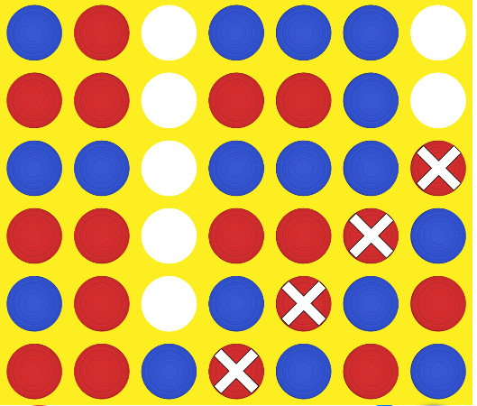

# Connect 4

This is a Python project for playing Connect 4 game with an AI agent online.

## Getting Started

To run the project, you need to have Python 3 installed on your computer.

1. Clone the repository to your local machine
2. Install the required packages by running the following command in your terminal: 'pip install -r requirements.txt'
3. Open the connect4.py file in your code editor
4. Run the connect4.py file

## How to Play

- Open the following link in your web browser:[connect4](http://kevinshannon.com/connect4/)
- Wait for the game to load and start a new game
- The AI agent will automatically select a column to play
- Watch the game progress and see who wins!

## Code Structure

- connect4.py: the main file that contains the game logic and the AI algorithm
- board.py: a helper file that defines the Board class for capturing and processing the game board image

## AI Algorithm

The AI algorithm used in this project is a minimax algorithm with alpha-beta pruning. The algorithm searches for the best move to play by recursively evaluating the possible moves up to a certain depth.
The evaluation function used in this project assigns scores to the game board based on:

1. the number of player pieces in a row, column, or diagonal
2. the number of opponent pieces in a row, column, or diagonal
3. the number of open spaces adjacent to player and opponent pieces

The algorithm then chooses the move that leads to the highest score for the player and the lowest score for the opponent.

1. 
2. 
3. ....
4. 
5. ...
6. 

## License

This project is licensed under the MIT License. See the [LICENSE](https://github.com/MahmoudSayedA/Connect_4-game/blob/master/LICENSE) file for details.
